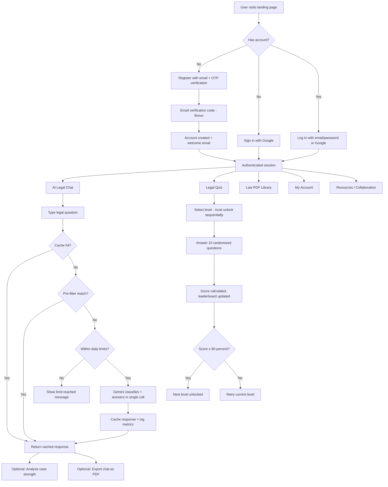
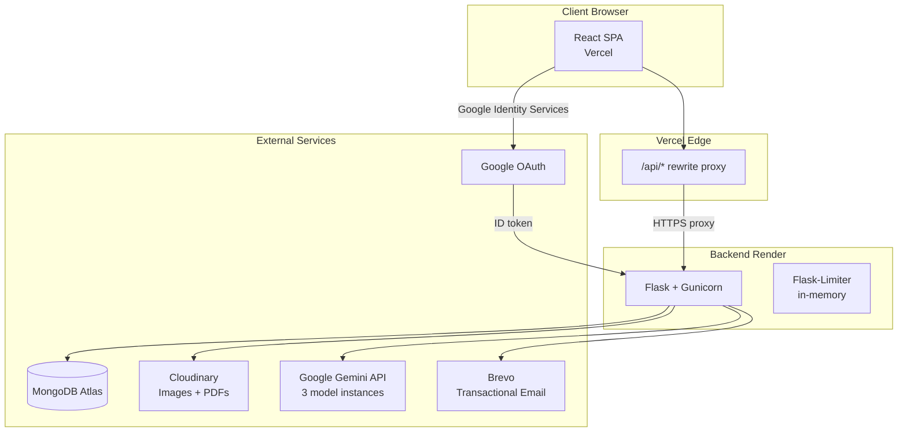

# ⚖️ Justice Genie

**AI-powered legal assistance platform for Indian law** — helping individuals and small businesses understand their legal rights through conversational AI, interactive learning, and curated legal resources.

> **Disclaimer:** Justice Genie provides AI-generated legal information for **educational purposes only**. It does not replace professional legal advice. Always consult a qualified legal professional for critical legal matters.

---

## Table of Contents

- [What Is Justice Genie?](#what-is-justice-genie)
- [Key Capabilities](#key-capabilities)
- [Product Workflow](#product-workflow)
- [Architecture](#architecture)
- [Technology Stack](#technology-stack)
- [Repository Structure](#repository-structure)
- [Core System Components](#core-system-components)
- [Data Layer](#data-layer)
- [AI / Intelligence Layer](#ai--intelligence-layer)
- [Authentication & Security](#authentication--security)
- [Environment Configuration](#environment-configuration)
- [Local Development](#local-development)
- [Production / Deployment](#production--deployment)
- [Current Status](#current-status)
- [Roadmap / Future Work](#roadmap--future-work)
- [Upcoming Release](#upcoming-release)
- [Project Ownership & Contribution](#project-ownership--contribution)
- [License](#license)

---

## What Is Justice Genie?

Justice Genie bridges the gap between complex legal systems and everyday users. The Indian legal system — with its extensive Indian Penal Code (IPC), procedural rules, and landmark case law — is difficult for non-lawyers to navigate. Justice Genie provides:

- **Instant AI-generated legal explanations** grounded in IPC sections, relevant statutes, and landmark case references
- **Case strength analysis** that evaluates the strengths, weaknesses, and critical gaps in a described legal situation
- **Interactive legal quizzes** with progressive difficulty levels and a competitive leaderboard
- **A curated library of legal reference documents** (PDFs hosted on Cloudinary)

The goal is **legal awareness, accessibility, and empowerment** — not replacing lawyers, but helping people know enough to ask the right questions.

---

## Key Capabilities

| Capability | Description | Status |
|---|---|---|
| **AI Legal Chat** | Conversational assistant powered by Google Gemini, specializing in IPC and Indian law. Classifies queries and responds with structured legal analysis including applicable sections, key elements, punishments, nuances, and landmark cases. | ✅ Implemented |
| **Case Strength Analysis** | AI-powered analysis of a legal situation's strength, producing a score, key strengths/weaknesses, and critical missing information — visualized as a Chart.js doughnut gauge. | ✅ Implemented |
| **Legal Quiz System** | Multi-level quiz engine with randomized questions, progressive difficulty, cumulative scoring, per-level high scores, and a global leaderboard. | ✅ Implemented |
| **Legal Document Library** | Browsable collection of legal reference PDFs stored on Cloudinary, with category filtering and view/download tracking. | ✅ Implemented |
| **Chat History & PDF Export** | Per-user chat persistence with export to professionally formatted PDF supporting mixed English, Hindi, and Telugu text. | ✅ Implemented |
| **User Account Management** | Profile pictures, game name customization, quiz stats dashboard, and full account deletion with data cleanup. | ✅ Implemented |
| **Admin Panel** | Paginated user management, collaboration/feedback review, quiz oversight, temporary account locking, and a monitoring metrics endpoint. | ✅ Implemented |
| **Google Sign-In** | OAuth 2.0 via Google Identity Services — auto-account creation, username collision handling, and seamless integration with existing accounts. | ✅ Implemented |
| **Transactional Email** | Branded HTML emails for verification, welcome, password reset, collaboration confirmation, account alerts, and account deletion — sent via Brevo. | ✅ Implemented |
| **Response Caching** | Query-level caching of Gemini responses with automatic expiry, reducing API costs and latency for repeated questions. | ✅ Implemented |
| **Usage Rate Limiting** | Per-user and global daily Gemini call limits, plus per-endpoint HTTP rate limiting via Flask-Limiter. | ✅ Implemented |
| **Dark Mode** | User-toggleable dark theme on the chat interface. | ✅ Implemented |
| **Voice Features** | Text-to-speech, speech-to-text. Routes exist but return placeholder messages in production. | ⏳ Stubbed |
| **Translation** | Multilingual translation endpoint. Route exists but returns a placeholder in production. | ⏳ Stubbed |

---

## Product Workflow



---

## Architecture



**Key architectural decisions:**

- **Vercel rewrite proxy** (`/api/*` → Render backend) makes all requests same-origin from the browser's perspective, avoiding cross-site cookie issues (especially Safari's third-party cookie blocking).
- **Three separate Gemini model instances** are configured at startup, each bound to its own API key to avoid a race condition where `genai.configure()` overwrites global state. The primary chat model, fallback model, and analysis model each lock in their client at boot.
- **Flask server-side sessions** (not JWTs) — session cookie with `SameSite=Lax`, `Secure=true` in production.
- **Single-worker deployment** on Render free tier — rate limiter uses in-memory storage (no Redis needed at current scale).

---

## Technology Stack

### Frontend

| Technology | Purpose |
|---|---|
| React 18 (Create React App) | SPA framework |
| Tailwind CSS 3 + Custom CSS | Styling (design system v2: Manrope body, Poppins headings) |
| Framer Motion | Page transitions and animations |
| Chart.js | Case strength doughnut charts |
| Ant Design | UI component library (selective usage) |
| React Router v7 | Client-side routing |
| Axios | HTTP client |
| React Markdown + remark-gfm | Rendering AI responses as formatted markdown |
| SweetAlert2 + React Toastify | Notifications and confirmations |
| Lucide React + React Icons + Font Awesome | Iconography |
| react-helmet-async | Per-page SEO meta tags |

### Backend

| Technology | Purpose |
|---|---|
| Python 3.11 | Runtime |
| Flask 3.0 | Web framework |
| Gunicorn | Production WSGI server |
| Flask-CORS | Cross-origin request handling |
| Flask-Limiter | Per-endpoint rate limiting |
| PyMongo 4.10 | MongoDB driver |
| google-generativeai 0.7 | Gemini API SDK |
| google-auth | Google OAuth ID token verification |
| Cloudinary SDK | Image/PDF cloud storage |
| sib-api-v3-sdk | Brevo transactional email |
| ReportLab | PDF generation (with Unicode font support) |
| markdown2 | Markdown-to-HTML conversion |
| translate | Translation library (currently unused in production routes) |
| Werkzeug | Password hashing (PBKDF2) |
| python-dotenv | Environment variable management |

### Infrastructure

| Service | Purpose |
|---|---|
| Vercel | Frontend hosting + API rewrite proxy |
| Render (free tier) | Backend hosting (single Gunicorn worker) |
| MongoDB Atlas | Production database |
| Cloudinary | Profile pictures + legal PDF storage |
| Brevo | Transactional email (verification, welcome, reset, alerts) |
| Google AI Studio | Gemini API quota management |

---

## Repository Structure

```
JusticeGenie2.0-Original/
├── backend/
│   ├── app.py              # Flask app factory, blueprint registration, health check
│   ├── config.py            # Environment, logging, session/cookie config, CORS
│   ├── extensions.py        # MongoDB, Cloudinary, Gemini, Brevo, rate limiter init
│   ├── requirements.txt     # Python dependencies
│   ├── .env.example         # Environment variable template
│   ├── routes/              # Flask blueprints
│   │   ├── auth.py          #   Email/password auth (register, OTP, login, password reset)
│   │   ├── google_auth.py   #   Google Sign-In flow
│   │   ├── chat.py          #   AI chat endpoint (caching, limits, Gemini calls)
│   │   ├── analysis.py      #   Case strength analysis
│   │   ├── quiz.py          #   Quiz engine + leaderboard
│   │   ├── books.py         #   Legal document library + collaboration requests
│   │   ├── account.py       #   User profile, PDF export, account deletion
│   │   ├── admin.py         #   Admin panel endpoints + monitoring
│   │   └── feedback.py      #   User feedback
│   └── utils/
│       ├── decorators.py    #   Auth decorators (@login_required, @admin_required)
│       └── email.py         #   Brevo email sender + HTML templates
│
├── frontend/
│   ├── package.json         # React dependencies and scripts
│   ├── vercel.json          # Vercel rewrite rules (/api/* → Render backend)
│   ├── tailwind.config.js   # Design system config
│   ├── public/              # Static assets, SEO (sitemap, robots.txt, OG image)
│   └── src/
│       ├── App.js           # Router, page transitions, auth provider
│       ├── context/         # AuthContext (session verification, shared logout)
│       ├── components/      # 21 React components (pages + shared UI)
│       ├── content/         # Legal text (Privacy Policy, Terms of Service)
│       └── styles/          # Tailwind imports
│
├── .gitignore
└── README.md
```

---

## Core System Components

### Chat Engine

The main `/api/chat` endpoint implements a multi-stage pipeline designed to minimize Gemini API costs while providing quality responses:

1. **Cache check** — Normalized query hashing returns previously cached responses instantly, with no API call.
2. **Pre-filter** — Common greetings, thanks, and meta-questions are handled with pattern matching — zero API cost.
3. **Daily usage check** — Per-user and global daily counters prevent runaway API spend on the free tier.
4. **Merged Gemini call** — A single prompt classifies the query intent (Legal, Legal General, Conversational, Off-Topic) and generates the response in one API call.
5. **Automatic fallback** — If the primary model's quota is exhausted, the request is transparently retried with a fallback model on a separate quota pool.
6. **Metrics logging** — Per-request analytics (latency, token counts, cache hits, intent distribution) are recorded with automatic expiry.

### Admin System

Role-protected admin dashboard providing paginated user management, collaboration/feedback review, quiz participant oversight with ranked leaderboard, temporary account locking with email notification, and an API-key-authenticated monitoring metrics endpoint.

### PDF Export

Generates professionally formatted PDFs using ReportLab with markdown rendering and **multi-script Unicode support** — mixed English, Hindi, and Telugu text renders correctly using Noto Sans font families.

---

## Data Layer

**Database:** MongoDB (local instance in development, MongoDB Atlas in production)

The application uses 10 collections across user management, chat, quizzes, content, and analytics:

| Collection | Purpose |
|---|---|
| `users` | User accounts — credentials, profile, quiz progress, feedback status |
| `chats` | Per-user chat message history (also used for PDF export) |
| `quizzquestions` | Quiz question bank with questions, options, correct answers, and explanations |
| `leaderboard` | Cumulative quiz scores per user for the global leaderboard |
| `books` | Legal document metadata (title, category, Cloudinary file URL, view/download counts) |
| `collaborations` | Collaboration requests submitted by users |
| `feedback` | User feedback (text + star ratings) |
| `query_cache` | Cached Gemini responses — auto-expires to keep answers fresh |
| `chat_metrics` | Per-request analytics (latency, tokens, cache hits) — auto-expires |
| `daily_usage` | Daily Gemini call counters (per-user and global) — auto-expires |

Key relationships: each user has one chat document (containing an array of messages), one optional leaderboard entry, and one optional collaboration/feedback record. Chat messages can carry embedded case-analysis results. The user document tracks quiz progression across levels.

---

## AI / Intelligence Layer

Justice Genie uses **Google Gemini** as its sole AI provider. There is no local model, no fine-tuning, and no RAG pipeline at this time.

### How It Works

Three separate Gemini model instances are configured at startup — a primary chat model, a fallback model (separate quota pool), and a dedicated analysis model — each bound to its own API key to isolate quotas and avoid configuration conflicts.

**Chat:** A merged prompt instructs Gemini to both classify the query intent and generate the response in a single API call. Legal responses follow a structured template covering applicable IPC sections, key elements, punishment, important nuances, landmark cases, and a disclaimer.

**Case Analysis:** A separate prompt asks Gemini to evaluate a legal situation and return a structured assessment (case strength, key strengths/weaknesses, critical missing information).

### Cost Optimization

- **Response caching** — Identical queries are served from a cached response store without touching Gemini.
- **Pre-filtering** — Common greetings and meta-questions are handled with pattern matching at zero API cost.
- **Daily usage limits** — Per-user and global daily caps prevent runaway API spend on the free tier.
- **Single-call design** — Merged classification + response generation in one call halved Gemini usage compared to the original two-call approach.

---

## Authentication & Security

### Authentication Methods

1. **Email/Password** — Registration requires email OTP verification. Passwords are hashed with Werkzeug's PBKDF2.
2. **Google Sign-In** — ID token verified server-side. Auto-links to existing accounts by verified email. Handles username collisions via a "pick a username" flow.

### Session & Security

- **Server-side Flask sessions** — `SameSite=Lax` cookie policy (enabled by the Vercel rewrite proxy making all requests same-origin), `Secure` flag in production.
- **Session-based identity** — User identity is always read from the server session, never from client-supplied request data.
- **OTP brute-force protection** — Verification codes have expiry windows and attempt limits; invalidated after either is exceeded.
- **Rate limiting** — Per-endpoint rate limiting on sensitive routes (login, chat) via Flask-Limiter.
- **Admin authorization** — All admin routes are protected by a role-check decorator.
- **API-key-protected monitoring** — The metrics endpoint uses constant-time key comparison.
- **Global error handler** — Unhandled exceptions return generic JSON; full details are logged server-side only.

---

## Environment Configuration

### Backend (`backend/.env`)

| Variable | Purpose |
|---|---|
| `APP_ENV` | `development` or `production` — controls MongoDB connection, cookie security, debug mode |
| `SECRET_KEY` | Flask session signing key (required) |
| `MONGO_USER`, `MONGO_PASS`, `MONGO_CLUSTER` | MongoDB Atlas credentials (production only) |
| `GEMINI_API_KEY` | Primary Gemini model API key |
| `GEMINI_API_KEY_FALL_BACK` | Fallback Gemini model API key |
| `GEMINI_ANALYZE_API_KEY` | Analysis Gemini model API key |
| `CLOUDINARY_CLOUD_NAME`, `CLOUDINARY_API_KEY`, `CLOUDINARY_API_SECRET` | Cloudinary configuration |
| `BREVO_API_KEY`, `BREVO_SENDER_EMAIL`, `BREVO_SENDER_NAME` | Brevo transactional email configuration |
| `GOOGLE_CLIENT_ID` | Google OAuth client ID |
| `MONITORING_API_KEY` | API key for the `/monitor/metrics` endpoint |

### Frontend (`frontend/.env`)

| Variable | Purpose |
|---|---|
| `REACT_APP_GOOGLE_CLIENT_ID` | Google OAuth client ID (baked into the build at compile time) |

> **Never commit `.env` files.** Use `.env.example` as a template. In production, set variables via Render's Environment tab (backend) and Vercel's Project Settings > Environment Variables (frontend).

---

## Local Development

### Prerequisites

- **Node.js** (LTS) and npm
- **Python 3.11+**
- **MongoDB** running locally on `mongodb://localhost:27017/`

### Backend Setup

```bash
cd backend

# Create and activate a virtual environment
python -m venv venv
# Windows:
venv\Scripts\activate
# macOS/Linux:
source venv/bin/activate

# Install dependencies
pip install -r requirements.txt

# Copy and configure environment variables
cp .env.example .env
# Edit .env with your API keys and SECRET_KEY

# Run the development server
python app.py
```

The backend runs on `http://localhost:5000` by default.

### Frontend Setup

```bash
cd frontend

# Install dependencies
npm install

# Copy and configure environment variables
cp .env.example .env

# Start the development server
npm start
```

The frontend runs on `http://localhost:3000` and proxies `/api/*` requests to `http://localhost:5000` (configured in `package.json`).

### Optional: Unicode PDF Support

For correct Hindi and Telugu rendering in exported PDFs, download Noto Sans font files from Google Fonts and place them in `backend/routes/fonts/`:

```
fonts/NotoSans-Regular.ttf
fonts/NotoSans-Bold.ttf
fonts/NotoSansDevanagari-Regular.ttf
fonts/NotoSansDevanagari-Bold.ttf
fonts/NotoSansTelugu-Regular.ttf
fonts/NotoSansTelugu-Bold.ttf
```

PDF export falls back to Helvetica (ASCII only) if fonts are missing.

---

## Production / Deployment

### Current Architecture

| Component | Platform | URL |
|---|---|---|
| Frontend | Vercel | `https://justice-genie-mu.vercel.app` |
| Backend | Render (free tier) | `https://justice-genie-2fcx.onrender.com` |
| Database | MongoDB Atlas | Cloud-hosted cluster |

### How It Works

1. **Frontend** is a static React build deployed on Vercel. The `vercel.json` configuration rewrites all `/api/*` requests to the Render backend, making everything same-origin.
2. **Backend** runs as a Flask app under Gunicorn on Render's free tier (single worker). `APP_ENV=production` is set in Render's environment variables, which activates Atlas connection, secure cookies, and production logging.
3. **Health check** — A `/health` endpoint (exempt from rate limiting) is available for external uptime pingers (e.g., UptimeRobot, cron-job.org) to prevent Render's free tier from spinning down after 15 minutes of inactivity.

### Deploying Changes

- **Frontend:** Push to the main branch; Vercel auto-deploys. Environment variables must be set in Vercel's Project Settings.
- **Backend:** Push to the main branch; Render auto-deploys. Environment variables must be set in Render's Environment tab.

---

## Current Status

### What's Implemented

Justice Genie is a working, deployed application with substantial engineering work completed:

- **Full authentication system** — Email/password with OTP verification, Google Sign-In, forgot/reset password flow
- **AI legal chat engine** — Gemini-powered with response caching, pre-filtering, daily usage limits, and automatic model fallback
- **Case strength analysis** — AI analysis with structured output and Chart.js visualization
- **Multi-level quiz system** — Progressive difficulty, cumulative scoring, and competitive leaderboard
- **Legal document library** — Category-filtered browsing with Cloudinary-hosted PDFs
- **User account system** — Profile management, quiz stats, multilingual PDF export, full account deletion with data cleanup
- **Admin dashboard** — User management, collaboration/feedback review, quiz oversight, account locking, monitoring metrics
- **Transactional email** — Branded HTML emails for the full user lifecycle (verification, welcome, reset, alerts, farewell)
- **Production deployment** — Frontend on Vercel, backend on Render, database on MongoDB Atlas
- **SEO & observability** — Open Graph, Twitter Cards, sitemap, per-request chat analytics with auto-expiry
- **Design system v2** — Manrope/Poppins typography, layered shadows, scroll-reveal animations, dark mode

### Known Limitations

- **Voice features are stubbed** — Text-to-speech, speech-to-text, and translation endpoints exist but return placeholder responses in production (require system-level audio dependencies not available on the hosting platform).
- **Single-worker deployment** — Rate limiter and some registration state are in-memory; resets on restart and not shared across workers. Adequate for current scale but would need Redis for multi-worker scaling.
- **No automated backend tests** — Backend testing is currently manual.

---

## Roadmap / Future Work

### BNS Transition & RAG-Based Knowledge Retrieval (In Development)

The next release of Justice Genie is planned to transition the legal knowledge and corpus from the older **IPC (Indian Penal Code)** framework to the newer **BNS (Bharatiya Nyaya Sanhita)** framework. While the current implementation remains IPC-based, this upcoming transition to BNS will serve as an essential foundation for evolving the project toward a **Retrieval-Augmented Generation (RAG)** architecture. 

**Subhash and Siri are currently working on this direction.** The goals include:

- **Source-aware responses** — AI answers grounded in specific legal documents, statutes, and case law rather than relying solely on the model's training data
- **Document retrieval** — Embedding and indexing the existing legal document library for semantic search
- **Vector search integration** — Enabling retrieval of relevant legal passages before generating responses
- **Evaluation and fallback** — Measuring retrieval quality and gracefully falling back when source material is insufficient

RAG is **not yet implemented** in the current codebase. The existing architecture — particularly the document library, caching layer, and Gemini integration — is being evaluated as a foundation for this evolution. This remains active development work, not a shipped feature.

### Other Future Work

- Productionizing voice features (text-to-speech and speech-to-text)
- Multilingual translation support
- Redis-backed rate limiting and session storage for multi-worker scaling
- Automated backend testing
- Enhanced analytics and admin dashboard insights

---

## Upcoming Release

The project is targeting a new release around **September 1, 2026**. This represents continued development toward the features and improvements described in the roadmap above.

---

## Project Ownership & Contribution

Justice Genie is a **jointly developed academic and research project** by:

- **Vemula Siri Mahalaxmi** — AI logic, prompt engineering, backend architecture, system design
- **Yaganti Subhash** — Frontend development, API integration, UI/UX

> **Repository Notice:** This repository was originally created under Yaganti Subhash's GitHub account and later forked by Vemula Siri Mahalaxmi. The project was designed, developed, and documented collaboratively by both contributors.

---

## License

This project is licensed under a **Custom Academic Non-Commercial License**:

- ❌ Commercial use prohibited
- ❌ Redistribution prohibited
- ❌ Plagiarism prohibited
- ✅ Academic reference allowed with proper credit

> ⚠️ This project is **not open-source for free use**. Unauthorized copying, cloning, or commercial use is strictly prohibited.

---

<p align="center">
  <strong>Copyright © 2025 Vemula Siri Mahalaxmi & Yaganti Subhash. All rights reserved.</strong><br/>
  <em>Built with responsibility, ethics, and innovation at its core.</em>
</p>
