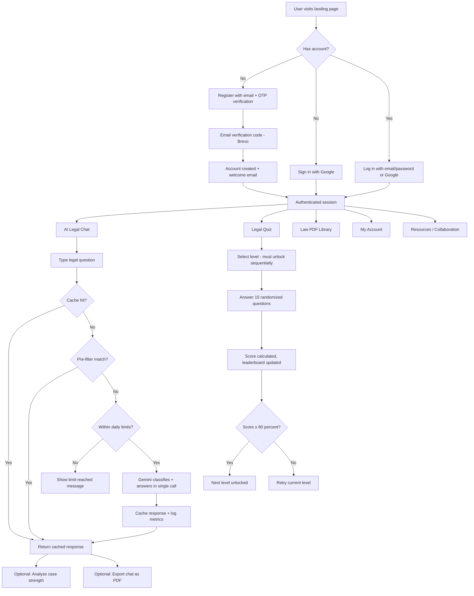
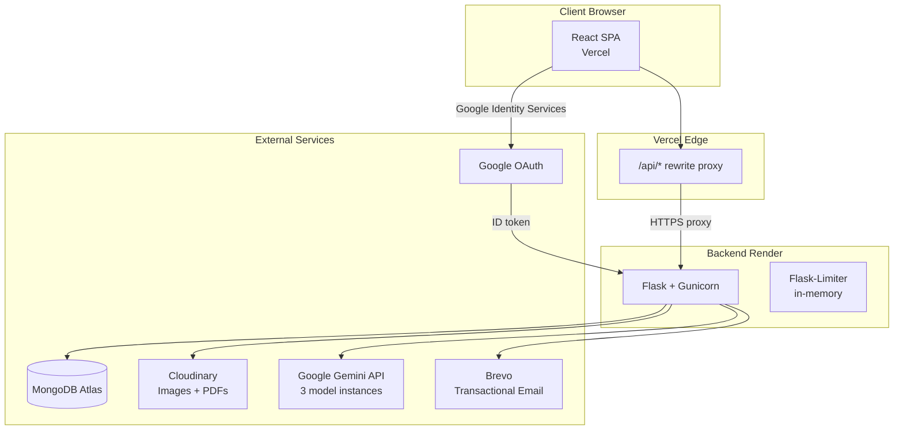

# ⚖️ Justice Genie 2.0

**AI-powered legal assistance platform for Indian law** — helping individuals and small businesses understand their legal rights through conversational AI, interactive learning, and curated legal resources.

> **Disclaimer:** Justice Genie provides AI-generated legal information for **educational purposes only**. It does not replace professional legal advice. Always consult a qualified legal professional for critical legal matters.

---

## Table of Contents

- [What Is Justice Genie?](#what-is-justice-genie)
- [Key Capabilities](#key-capabilities)
- [Product Workflow](#product-workflow)
- [Architecture](#architecture)
- [Technology Stack](#technology-stack)
- [Repository Structure](#repository-structure)
- [Core System Components](#core-system-components)
- [Data Layer](#data-layer)
- [AI / Intelligence Layer](#ai--intelligence-layer)
- [Integrations](#integrations)
- [Authentication & Security](#authentication--security)
- [Environment Configuration](#environment-configuration)
- [Local Development](#local-development)
- [Production / Deployment](#production--deployment)
- [Testing](#testing)
- [Current Status](#current-status)
- [Roadmap / Future Work](#roadmap--future-work)
- [Upcoming Release](#upcoming-release)
- [Project Ownership & Contribution](#project-ownership--contribution)
- [License](#license)

---

## What Is Justice Genie?

Justice Genie 2.0 bridges the gap between complex legal systems and everyday users. The Indian legal system — with its extensive Indian Penal Code (IPC), procedural rules, and landmark case law — is difficult for non-lawyers to navigate. Justice Genie provides:

- **Instant AI-generated legal explanations** grounded in IPC sections, relevant statutes, and landmark case references
- **Case strength analysis** that evaluates the strengths, weaknesses, and critical gaps in a described legal situation
- **Interactive legal quizzes** with progressive difficulty levels and a competitive leaderboard
- **A curated library of legal reference documents** (PDFs hosted on Cloudinary)

The goal is **legal awareness, accessibility, and empowerment** — not replacing lawyers, but helping people know enough to ask the right questions.

---

## Key Capabilities

| Capability | Description | Status |
|---|---|---|
| **AI Legal Chat** | Conversational assistant powered by Google Gemini, specializing in IPC and Indian law. Classifies queries (Legal, Legal General, Conversational, Off-Topic) and responds with structured legal analysis including applicable sections, key elements, punishments, nuances, and landmark cases. | ✅ Implemented |
| **Case Strength Analysis** | Gemini-powered analysis of a legal query's strength, producing a score (0–95), key strengths/weaknesses, and critical missing information, visualized as a Chart.js doughnut gauge. | ✅ Implemented |
| **Legal Quiz System** | Multi-level quiz engine with 15 randomized questions per level, 80% pass threshold for progression, cumulative scoring, per-level high scores, and a global leaderboard with dense ranking. | ✅ Implemented |
| **Legal Document Library** | Browsable and searchable collection of legal PDFs (IPC, Indian law references) stored on Cloudinary, with view/download tracking. | ✅ Implemented |
| **Chat History & PDF Export** | Per-user chat persistence in MongoDB, with export to professionally formatted PDF (supports mixed English/Hindi/Telugu text via Noto Sans font families). | ✅ Implemented |
| **User Account Management** | Profile pictures (Cloudinary), game name customization, quiz stats dashboard, account deletion with data cleanup and goodbye email. | ✅ Implemented |
| **Admin Panel** | Paginated user management, collaboration request review, feedback review, quiz participant oversight, account locking (time-based), and a monitoring metrics endpoint. | ✅ Implemented |
| **Collaboration System** | Users can submit collaboration requests with technical skills/experience; reviewed by admins; confirmation email sent on submission. | ✅ Implemented |
| **Feedback System** | Star-rating + text feedback submission (one per user), tracked in user profile, viewable by admins. | ✅ Implemented |
| **Google Sign-In** | Full OAuth 2.0 flow via Google Identity Services — auto-account creation, username collision handling, and seamless session integration with existing email/password accounts. | ✅ Implemented |
| **Transactional Email** | Branded HTML emails for verification, welcome, password reset, collaboration confirmation, account lock alerts, and account deletion farewell — sent via Brevo API. | ✅ Implemented |
| **Response Caching** | SHA-256 normalized query hashing with a 7-day TTL cache of Gemini responses, reducing API costs and latency for repeated questions. | ✅ Implemented |
| **Usage Rate Limiting** | Per-user (5/day) and global (35/day) daily Gemini call limits with atomic MongoDB counters, plus per-endpoint Flask rate limiting. | ✅ Implemented |
| **Dark Mode** | User-toggleable dark theme on the chat interface. | ✅ Implemented |
| **Voice Features** | Text-to-speech, speech-to-text. Routes exist but return placeholder messages in production. | ⏳ Stubbed |
| **Translation** | Multilingual translation endpoint. Route exists but returns a placeholder message in production. | ⏳ Stubbed |

---

## Product Workflow



---

## Architecture



**Key architectural decisions:**

- **Vercel rewrite proxy** (`/api/*` → Render backend) makes all requests same-origin from the browser's perspective, avoiding cross-site cookie issues (especially Safari's third-party cookie blocking).
- **Three separate Gemini model instances** are configured at startup, each bound to its own API key to avoid a race condition where `genai.configure()` overwrites global state. The primary chat model, fallback model, and analysis model each lock in their client at boot.
- **Flask server-side sessions** (not JWTs) — session cookie with `SameSite=Lax`, `Secure=true` in production.
- **Single-worker deployment** on Render free tier — rate limiter uses in-memory storage (no Redis needed at current scale).

---

## Technology Stack

### Frontend

| Technology | Purpose |
|---|---|
| React 18 (Create React App) | SPA framework |
| Tailwind CSS 3 + Custom CSS | Styling (design system v2: Manrope body, Poppins headings) |
| Framer Motion | Page transitions and animations |
| Chart.js | Case strength doughnut charts |
| Ant Design | UI component library (selective usage) |
| React Router v7 | Client-side routing |
| Axios | HTTP client |
| React Markdown + remark-gfm | Rendering AI responses as formatted markdown |
| SweetAlert2 + React Toastify | Notifications and confirmations |
| Lucide React + React Icons + Font Awesome | Iconography |
| react-helmet-async | Per-page SEO meta tags |

### Backend

| Technology | Purpose |
|---|---|
| Python 3.11 | Runtime |
| Flask 3.0 | Web framework |
| Gunicorn | Production WSGI server |
| Flask-CORS | Cross-origin request handling |
| Flask-Limiter | Per-endpoint rate limiting |
| PyMongo 4.10 | MongoDB driver |
| google-generativeai 0.7 | Gemini API SDK |
| google-auth | Google OAuth ID token verification |
| Cloudinary SDK | Image/PDF cloud storage |
| sib-api-v3-sdk | Brevo transactional email |
| ReportLab | PDF generation (with Unicode font support) |
| markdown2 | Markdown-to-HTML conversion |
| translate | Translation library (currently unused in production routes) |
| Werkzeug | Password hashing (PBKDF2) |
| python-dotenv | Environment variable management |

### Infrastructure

| Service | Purpose |
|---|---|
| Vercel | Frontend hosting + API rewrite proxy |
| Render (free tier) | Backend hosting (single Gunicorn worker) |
| MongoDB Atlas | Production database |
| Cloudinary | Profile pictures + legal PDF storage |
| Brevo | Transactional email (verification, welcome, reset, alerts) |
| Google AI Studio | Gemini API quota management |

---

## Repository Structure

```
JusticeGenie2.0-Original/
├── backend/
│   ├── app.py                  # Flask app factory, blueprint registration, health check
│   ├── config.py               # Env loading, logging, session/cookie config, CORS origins
│   ├── extensions.py           # MongoDB, Cloudinary, Gemini, Brevo, rate limiter setup + indexes
│   ├── speech_features.py      # Local-only speech functions (not used in production)
│   ├── requirements.txt        # Python dependencies
│   ├── .env.example            # Environment variable template
│   ├── .python-version         # Python 3.11.11
│   ├── routes/
│   │   ├── auth.py             # Register, verify OTP, login, logout, forgot/reset password
│   │   ├── google_auth.py      # Google Sign-In (ID token verification, auto-signup)
│   │   ├── chat.py             # Main AI chat endpoint, caching, pre-filtering, usage limits
│   │   ├── analysis.py         # Case strength analysis (Gemini) + saving to chat history
│   │   ├── quiz.py             # Quiz retrieval, submission, scoring, leaderboard
│   │   ├── books.py            # Legal document library + collaboration requests
│   │   ├── account.py          # Profile pics, account info, PDF export, account deletion
│   │   ├── admin.py            # User management, feedback review, monitoring metrics
│   │   └── feedback.py         # Feedback submission + status check
│   └── utils/
│       ├── decorators.py       # @login_required and @admin_required decorators
│       └── email.py            # Brevo email sender + HTML templates
│
├── frontend/
│   ├── package.json            # React dependencies and scripts
│   ├── vercel.json             # Vercel rewrite rules (/api/* -> Render backend)
│   ├── tailwind.config.js      # Design system v2 config (fonts, animations, shadows)
│   ├── public/
│   │   ├── index.html          # SEO meta tags, Open Graph, Google Fonts, favicons
│   │   ├── sitemap.xml         # Search engine sitemap
│   │   ├── robots.txt          # Crawler directives
│   │   └── og-image.png        # Social media preview image
│   └── src/
│       ├── App.js              # Router, AnimatePresence, ToastContainer, AuthProvider
│       ├── context/
│       │   └── AuthContext.jsx  # Session verification, auth state, shared logout
│       ├── components/
│       │   ├── LandingPage.jsx  # Public landing page
│       │   ├── IntroPage.jsx    # Product introduction
│       │   ├── login.jsx        # Email/password + Google sign-in
│       │   ├── register.jsx     # Registration with OTP verification
│       │   ├── forgotpassword.jsx # Password reset flow
│       │   ├── chat.jsx         # Main AI chat interface (dark mode, analysis, export)
│       │   ├── AnalysisReport.jsx # Chart.js case strength visualization
│       │   ├── quizz.jsx        # Multi-level legal quiz
│       │   ├── lawpdf.jsx       # Legal document library browser
│       │   ├── myaccount.jsx    # User profile and stats dashboard
│       │   ├── resources.jsx    # Resources and collaboration form
│       │   ├── BenchmarkLibrary.jsx # Legal benchmark reference
│       │   ├── AdminPanel.jsx   # Admin dashboard
│       │   ├── UserManagement.jsx # Admin user management
│       │   ├── AdminCollab.jsx  # Admin collaboration review
│       │   ├── AdminFeedback.jsx # Admin feedback review
│       │   ├── AdminQuiz.jsx    # Admin quiz management
│       │   ├── GoogleSignInButton.jsx # Google Identity Services button
│       │   ├── LegalDocument.jsx # Privacy Policy / Terms of Service renderer
│       │   ├── ProtectedRoute.jsx # Auth-gated route wrapper
│       │   └── NotFound.jsx     # 404 page
│       ├── content/
│       │   ├── privacyPolicyContent.js  # Privacy Policy text
│       │   └── termsOfServiceContent.js # Terms of Service text
│       └── styles/
│           └── tailwind.css     # Tailwind base imports
│
├── .gitignore
└── README.md
```

---

## Core System Components

### Chat Engine (`routes/chat.py`)

The heart of the application. A single `/api/chat` endpoint handles the full request lifecycle:

1. **Cache check** — SHA-256 hash of the normalized query hits the `query_cache` collection (7-day TTL). On hit, returns immediately with zero Gemini cost.
2. **Pre-filter** — Regex-based matching catches bare greetings, thanks, and "who created you" queries without any API call.
3. **Daily usage check** — Atomic `$inc` operations on per-user and global daily counters (resets at midnight IST). Users get 5 Gemini calls/day; the app has a 35/day global safety cutoff below the actual API quota ceiling.
4. **Merged Gemini call** — A single prompt that classifies the query intent (LEGAL, LEGAL_GENERAL, CONVERSATIONAL, OFF_TOPIC) and generates the response in one API call (formerly two calls: classify then respond).
5. **Fallback model** — If the primary Gemini model returns `ResourceExhausted`, automatically retries with a fallback model on a separate API key and quota pool.
6. **Metrics logging** — Every request logs latency, token counts, cache/pre-filter hits, intent, and fallback usage to `chat_metrics` (90-day TTL).

### Admin System (`routes/admin.py`)

Protected by the `@admin_required` decorator. Provides:
- Paginated user listing with lock status
- Collaboration request and feedback review
- Quiz participant overview with correct dense-ranked leaderboard positions
- Temporary account locking (5-minute locks with email notification)
- `/monitor/metrics` — API-key-authenticated dashboard endpoint returning user counts, quiz statistics, and leaderboard highlights

### PDF Export (`routes/account.py`)

Generates professionally formatted PDFs using ReportLab with:
- Proper heading hierarchy (title, subtitle, query/response labels)
- Markdown rendering (bold, italic, newlines)
- **Multi-script Unicode support** — text is split by script (Latin, Devanagari, Telugu) and rendered with the appropriate Noto Sans font family, so mixed English/Hindi/Telugu content displays correctly.
- Footer with page numbers and disclaimer

---

## Data Layer

**Database:** MongoDB (local `mongod` in development, MongoDB Atlas in production)  
**Database name:** `law_chatbot`

### Collections

| Collection | Purpose | Key Indexes | TTL |
|---|---|---|---|
| `users` | User accounts (credentials, profile, quiz progress, feedback status) | `username` (unique), `email` (unique) | — |
| `chats` | Per-user chat message history (used by both chat and PDF export) | `user_id`, `username` | — |
| `quizzquestions` | Quiz question bank (question, options, correct answer, explanation, level) | — | — |
| `leaderboard` | Cumulative quiz scores per user | `username` (unique), `score` (descending) | — |
| `books` | Legal document metadata (title, category, Cloudinary file path, view/download counts) | `category` | — |
| `collaborations` | Collaboration requests from users | `submitted_by`, `email` | — |
| `feedback` | User feedback (text + star ratings) | — | — |
| `query_cache` | Cached Gemini responses keyed by SHA-256 query hash | `cached_at` (TTL) | **7 days** |
| `chat_metrics` | Per-request analytics (latency, tokens, cache hits, intent distribution) | `timestamp` (TTL) | **90 days** |
| `daily_usage` | Per-user and global daily Gemini call counters | `created_at` (TTL) | **3 days** |

### Key Data Relationships

- A **user** has one **chat** document (containing an array of messages), one optional **leaderboard** entry, one optional **collaboration** request, and one optional **feedback** entry.
- Each chat message can have an embedded `analysis` sub-document (case strength results) saved via array filter update.
- The `users` document accumulates quiz state: `quiz_level` (current unlocked level), `level_scores` (per-level high scores), `last_quiz_marks`, `last_quiz_percentage`.

---

## AI / Intelligence Layer

Justice Genie uses **Google Gemini** as its sole AI provider. There is no local model, no fine-tuning, and no RAG pipeline at this time.

### Model Configuration

Three model instances are created at server startup, each bound to a dedicated API key:

| Instance | Model | API Key | Purpose |
|---|---|---|---|
| `model` | `gemini-2.5-flash` | `GEMINI_API_KEY` | Primary chat (classify + answer) |
| `model_fallback` | `gemini-3.6-flash` | `GEMINI_API_KEY_FALL_BACK` | Fallback when primary quota is exhausted |
| `analyze_model` | `gemini-2.5-flash` | `GEMINI_ANALYZE_API_KEY` | Case strength analysis |

### Prompt Engineering

- **Chat prompt** — A merged prompt instructs Gemini to first classify the query into one of four intent categories, then respond according to category-specific formatting rules. Legal responses follow a strict template: Primary IPC Section(s), Key Elements, Punishment, Important Nuances, Landmark Case Example, and Disclaimer.
- **Analysis prompt** — Instructs Gemini to return a structured JSON object with `case_strength`, `strength_score`, `key_strengths`, `key_weaknesses`, and `critical_missing_info`. Score ranges are constrained by strength category (Weak: 10–35, Moderate: 40–65, Strong: 70–95).

### Cost Optimization

- **Response caching** — Identical queries (after normalization) are served from MongoDB for 7 days without touching Gemini.
- **Pre-filtering** — Obvious greetings, thanks, and creator questions are handled entirely with regex — zero API cost.
- **Daily usage limits** — Hard per-user and global daily caps prevent runaway API spend on the free tier.
- **Single-call classification** — Merged prompt (classify + answer in one call) halved Gemini usage compared to the original two-call design.

---

## Integrations

| Service | Purpose | How It's Used |
|---|---|---|
| **Google Gemini API** | Core AI responses and case analysis | Three model instances with separate API keys/quotas |
| **MongoDB Atlas** | Production database | Stores all user data, chats, quiz questions, analytics |
| **Cloudinary** | File hosting | Profile picture uploads (auto-resized), legal PDF storage and serving |
| **Brevo (Sendinblue)** | Transactional email | Verification codes, welcome emails, password resets, collaboration confirmations, account lock alerts, goodbye emails |
| **Google Identity Services** | Social authentication | "Sign in with Google" button, ID token, server-side verification |
| **Google Fonts** | Typography | Poppins, Manrope, Montserrat, Sora, Urbanist, Space Grotesk, Jura, Courgette |

---

## Authentication & Security

### Authentication Methods

1. **Email/Password** — Registration requires OTP verification (6-digit code via Brevo email, 10-minute expiry, max 5 attempts). Passwords are hashed with Werkzeug's PBKDF2.
2. **Google Sign-In** — ID token verified server-side against the configured `GOOGLE_CLIENT_ID`. Auto-links to existing accounts by verified email. Handles username collisions via a "pick a username" flow.

### Session Management

- Server-side Flask sessions with a 1-day lifetime.
- `SameSite=Lax` cookie policy (safe because the Vercel rewrite proxy makes requests same-origin).
- `Secure=true` in production (HTTPS), automatically disabled for local development (HTTP).

### Security Measures

- **Session-based identity** — Username and email are always read from the session, never from request bodies or query strings, preventing users from acting as other accounts.
- **OTP brute-force protection** — Maximum 5 attempts per verification code; code invalidated after expiry or exceeded attempts.
- **Password reset verification** — The reset-password endpoint re-verifies the reset code (with expiry and attempt limits), preventing direct bypass of the verification step.
- **Rate limiting** — Login: 10/min, Chat: 15/min, applied via Flask-Limiter.
- **Admin authorization** — All admin routes use the `@admin_required` decorator (checks `session['role'] == 'admin'`).
- **Monitoring API key** — The `/monitor/metrics` endpoint uses constant-time comparison (`secrets.compare_digest`) against a separate API key.
- **Account locking** — Admins can temporarily lock accounts (5-minute time-based locks stored in MongoDB).
- **Global error handler** — Unhandled exceptions return generic JSON errors; full details are logged server-side only.

---

## Environment Configuration

### Backend (`backend/.env`)

| Variable | Purpose |
|---|---|
| `APP_ENV` | `development` or `production` — controls MongoDB connection, cookie security, debug mode |
| `SECRET_KEY` | Flask session signing key (required) |
| `MONGO_USER`, `MONGO_PASS`, `MONGO_CLUSTER` | MongoDB Atlas credentials (production only) |
| `GEMINI_API_KEY` | Primary Gemini model API key |
| `GEMINI_API_KEY_FALL_BACK` | Fallback Gemini model API key |
| `GEMINI_ANALYZE_API_KEY` | Analysis Gemini model API key |
| `CLOUDINARY_CLOUD_NAME`, `CLOUDINARY_API_KEY`, `CLOUDINARY_API_SECRET` | Cloudinary configuration |
| `BREVO_API_KEY`, `BREVO_SENDER_EMAIL`, `BREVO_SENDER_NAME` | Brevo transactional email configuration |
| `GOOGLE_CLIENT_ID` | Google OAuth client ID |
| `MONITORING_API_KEY` | API key for the `/monitor/metrics` endpoint |

### Frontend (`frontend/.env`)

| Variable | Purpose |
|---|---|
| `REACT_APP_GOOGLE_CLIENT_ID` | Google OAuth client ID (baked into the build at compile time) |

> **Never commit `.env` files.** Use `.env.example` as a template. In production, set variables via Render's Environment tab (backend) and Vercel's Project Settings > Environment Variables (frontend).

---

## Local Development

### Prerequisites

- **Node.js** (LTS) and npm
- **Python 3.11+**
- **MongoDB** running locally on `mongodb://localhost:27017/`

### Backend Setup

```bash
cd backend

# Create and activate a virtual environment
python -m venv venv
# Windows:
venv\Scripts\activate
# macOS/Linux:
source venv/bin/activate

# Install dependencies
pip install -r requirements.txt

# Copy and configure environment variables
cp .env.example .env
# Edit .env with your API keys and SECRET_KEY

# Run the development server
python app.py
```

The backend runs on `http://localhost:5000` by default.

### Frontend Setup

```bash
cd frontend

# Install dependencies
npm install

# Copy and configure environment variables
cp .env.example .env

# Start the development server
npm start
```

The frontend runs on `http://localhost:3000` and proxies `/api/*` requests to `http://localhost:5000` (configured in `package.json`).

### Optional: Unicode PDF Support

For correct Hindi and Telugu rendering in exported PDFs, download Noto Sans font files from Google Fonts and place them in `backend/routes/fonts/`:

```
fonts/NotoSans-Regular.ttf
fonts/NotoSans-Bold.ttf
fonts/NotoSansDevanagari-Regular.ttf
fonts/NotoSansDevanagari-Bold.ttf
fonts/NotoSansTelugu-Regular.ttf
fonts/NotoSansTelugu-Bold.ttf
```

PDF export falls back to Helvetica (ASCII only) if fonts are missing.

---

## Production / Deployment

### Current Architecture

| Component | Platform | URL |
|---|---|---|
| Frontend | Vercel | `https://justice-genie-mu.vercel.app` |
| Backend | Render (free tier) | `https://justice-genie-2fcx.onrender.com` |
| Database | MongoDB Atlas | Cloud-hosted cluster |

### How It Works

1. **Frontend** is a static React build deployed on Vercel. The `vercel.json` configuration rewrites all `/api/*` requests to the Render backend, making everything same-origin.
2. **Backend** runs as a Flask app under Gunicorn on Render's free tier (single worker). `APP_ENV=production` is set in Render's environment variables, which activates Atlas connection, secure cookies, and production logging.
3. **Health check** — A `/health` endpoint (exempt from rate limiting) is available for external uptime pingers (e.g., UptimeRobot, cron-job.org) to prevent Render's free tier from spinning down after 15 minutes of inactivity.

### Deploying Changes

- **Frontend:** Push to the main branch; Vercel auto-deploys. Environment variables must be set in Vercel's Project Settings.
- **Backend:** Push to the main branch; Render auto-deploys. Environment variables must be set in Render's Environment tab.

---

## Testing

The project currently uses **Create React App's built-in test setup** (Jest + React Testing Library), with `setupTests.js` present in the frontend. Test files can be run with:

```bash
cd frontend
npm test
```

The backend does not have a dedicated test suite at this time. The `TEST_MODE` flag in `config.py` can be set to `True` to skip actual email sending during local development and manual testing.

---

## Current Status

### What's Implemented

Justice Genie 2.0 has undergone substantial development and is a working, deployed application:

- **Full authentication system** — Email/password with OTP verification, Google Sign-In with username collision handling, forgot/reset password flow, session management
- **AI legal chat engine** — Merged classification and response in a single Gemini call, with response caching, pre-filtering, daily usage limits, and automatic fallback to a secondary model
- **Case strength analysis** — Gemini-powered analysis with structured JSON output and Chart.js visualization
- **Multi-level quiz system** — Progressive difficulty, cumulative scoring, per-level high scores, competitive leaderboard with dense ranking
- **Legal document library** — Category-filtered browsing, Cloudinary-hosted PDFs with view/download analytics
- **User account system** — Profile pictures via Cloudinary, game names, quiz stats dashboard, PDF export of chat history with multilingual support, full account deletion with cascading data cleanup
- **Admin dashboard** — User management with pagination, collaboration/feedback review, quiz oversight, account locking, monitoring metrics endpoint
- **Transactional email system** — Six distinct branded HTML email templates sent via Brevo
- **Production deployment** — Frontend on Vercel, backend on Render, database on MongoDB Atlas, with a Vercel rewrite proxy solving cross-origin cookie issues
- **SEO infrastructure** — Open Graph tags, Twitter Cards, sitemap, robots.txt, favicons, per-page meta tags via react-helmet-async
- **Observability** — Per-request chat metrics (latency, token usage, cache hit rates, intent distribution) with 90-day auto-expiry
- **Design system v2** — Premium visual language with Manrope/Poppins typography, soft layered shadows, scroll-reveal animations, and dark mode

### Known Limitations

- **Voice features are stubbed** — Text-to-speech, speech-to-text, and translation endpoints exist but return placeholder messages in the production deployment. The local-only `speech_features.py` uses `pyttsx3` and `SpeechRecognition`, which require system-level audio dependencies not available on Render.
- **Single-worker deployment** — Rate limiter state is in-memory and resets on restart. Not suitable for multi-worker scaling without adding Redis.
- **In-memory unverified users** — Registration OTPs are stored in server memory (`unverified_users` dict), which resets on redeploy and doesn't share across workers.
- **No automated backend tests** — Backend relies on manual testing and the `TEST_MODE` flag for email-skipping.

---

## Roadmap / Future Work

### RAG-Based Knowledge Retrieval (In Development)

The project is evolving toward a **Retrieval-Augmented Generation (RAG)** architecture to improve the accuracy and groundedness of AI responses. **Subhash and Siri are currently working on this direction.** The goals include:

- **Source-aware responses** — AI answers grounded in specific legal documents, statutes, and case law rather than relying solely on the model's training data
- **Document retrieval** — Embedding and indexing the existing legal document library for semantic search
- **Vector search integration** — Enabling retrieval of relevant legal passages before generating responses
- **Evaluation and fallback** — Measuring retrieval quality and gracefully falling back when source material is insufficient

RAG is **not yet implemented** in the current codebase. The existing architecture — particularly the document library, caching layer, and Gemini integration — is being evaluated as a foundation for this evolution. This remains active development work, not a shipped feature.

### Other Future Work

- Productionizing voice features (text-to-speech and speech-to-text)
- Multilingual translation support
- Redis-backed rate limiting and session storage for multi-worker scaling
- Automated backend testing
- Enhanced analytics and admin dashboard insights

---

## Upcoming Release

The project is targeting a new release around **September 1, 2026**. This represents continued development toward the features and improvements described in the roadmap above.

---

## Project Ownership & Contribution

This project is a **jointly developed academic and research project**.

### Co-Creator: Vemula Siri Mahalaxmi
- AI Logic & Prompt Engineering
- Backend (Flask + Gemini Integration + API Integration)
- System Design & Documentation
- Feature Architecture & Flow

### Co-Creator: Yaganti Subhash
- Frontend Development (React UI)
- API Integration
- UI/UX Enhancements

> **Repository Notice:** This repository was originally created under Yaganti Subhash's GitHub account and later forked by Vemula Siri Mahalaxmi. Forking does not indicate sole ownership. The project was designed, developed, and documented collaboratively by both contributors.

---

## License

This project is licensed under a **Custom Academic Non-Commercial License**:

- ❌ Commercial use prohibited
- ❌ Redistribution prohibited
- ❌ Plagiarism prohibited
- ✅ Academic reference allowed with proper credit

> ⚠️ This project is **not open-source for free use**. Unauthorized copying, cloning, or commercial use is strictly prohibited.

---

<p align="center">
  <strong>Copyright © 2025 Vemula Siri Mahalaxmi & Yaganti Subhash. All rights reserved.</strong><br/>
  <em>Built with responsibility, ethics, and innovation at its core.</em>
</p>
